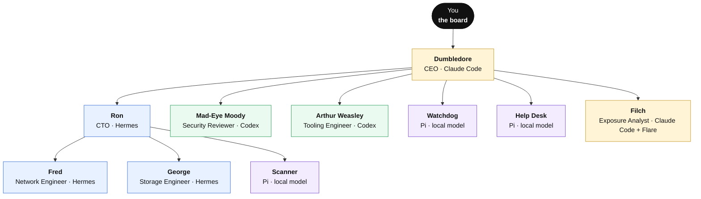

# Paperclip: build your AI IT department

**The companion guide to the NetworkChuck video.** 
Install Paperclip, hire your AI agents, and give them real work, one step at a time.

▶ Watch the video: <a href="https://youtu.be/7RVf25Rg0Mc">you need to try Paperclip RIGHT NOW!</a>

 

---

## What is Paperclip?

[Paperclip](https://paperclip.ing) is an open-source app for running a team of AI agents like a company. Your agents become employees. They get managers, job descriptions and tasks, and they talk to each other through those tasks. You sit at the top as **the board**: you approve hires, answer the big questions, and can stop anything.

It's a **meta-harness**. It doesn't replace Claude Code, Codex, Hermes or Pi. It hires them. Whatever agent you already use, and whatever comes out next month, can join the same company.

## What you'll build

The same department the video builds: a Claude Code CEO, three remote Hermes agents you already run, and a crew the CEO hires for you on Codex and on a free local model.

And here's that department as Paperclip draws it (a clean test install on 2026.916.1):

<table>
<tr>
<td width="50%"></td>
<td width="50%"></td>
</tr>
<tr>
<td align="center">Every harness on one roster: Claude Code, Codex, Hermes, Pi</td>
<td align="center">Each task carries its parent, blockers, reviewers, approvers and watchdog</td>
</tr>
</table>

## The path

Follow it in order the first time. Each chapter ends with a fix-it table for the problems people actually hit.

| # | Chapter | What you'll do |
|---|---------|----------------|
| 1 | [Pick a machine](guide/01-pick-a-machine.md) | Decide where Paperclip runs: your computer to play, a server to commit |
| 2 | [Install Paperclip](guide/02-install-paperclip.md) | Node 24, the install, onboarding, and keeping it running |
| 3 | [Your first company and CEO](guide/03-first-company-and-ceo.md) | Create the company, hire a Claude Code CEO, set the rules |
| 4 | [Hire remote Hermes agents](guide/04-hire-remote-hermes-agents.md) | Bring agents you already run on other machines into the company |
| 5 | [Build the team](guide/05-build-the-team.md) | Have the CEO hire Codex and local-model agents, with your approval |
| 6 | [Give them work](guide/06-give-them-work.md) | Projects, tasks, Cases, Decisions and Artifacts |
| 7 | [Approvals and watchdogs](guide/07-approvals-and-watchdogs.md) | Keep humans in charge and double-check "done" |
| 8 | [Routines and daily standups](guide/08-routines-and-standups.md) | Scheduled work, and a standup where agents ask each other questions |
| 9 | [Plug in Flare](guide/09-plug-in-flare.md) | Hire an agent that watches what's leaked about you |
| 10 | [Export your company](guide/10-export-your-company.md) | Package the whole department and import it anywhere |
| 11 | [Troubleshooting](guide/11-troubleshooting.md) | Every error we hit, and the fix |

## Take-home files

Copy-paste text for every prompt in the video's workflow, plus the Flare skill.

| File | What it's for |
|------|---------------|
| [`prompts/ceo-job-description.md`](prompts/ceo-job-description.md) | The CEO's job, pasted into its instructions |
| [`prompts/hire/`](prompts/hire) | Plain-English hire tickets: Security Reviewer, Tooling Engineer, Scanner, Watchdog, Help Desk, Exposure Analyst |
| [`prompts/tasks/`](prompts/tasks) | Test the team, the first real investigation, the first Flare sweep |
| [`prompts/routines/`](prompts/routines) | The daily storage check and the daily agent standup |
| [`skills/flare/`](skills/flare) | A Paperclip skill that reads your Flare feed and never prints a credential |

## Before you start

- **A machine.** Your Mac, a Linux box, or Windows with WSL2 is enough to try it. A VM or a cloud server if you want it running for real.
- **Node.js 24.11 or newer.** Chapter 2 shows how.
- **At least one AI account** your agents can use: a Claude subscription or API key, an OpenAI account for Codex, or a local model through Ollama.
- **Optional:** a [Hermes agent](https://www.youtube.com/watch?v=QQEgIo4Juxg) running somewhere, if you want to bring one in like the video does.

> [!NOTE]
> **Tested on Paperclip 2026.916.1** (September 2026). The video was filmed on 2026.831.1, a couple of weeks earlier. Paperclip moves fast; the chapters call out every place the screens changed. If something still doesn't match, the [official docs](https://docs.paperclip.ing) win.

## Links

- 📎 Paperclip: [paperclip.ing](https://paperclip.ing)
- 💻 Paperclip on GitHub: [paperclipai/paperclip](https://github.com/paperclipai/paperclip) (star the repo!)
- 📖 Official docs: [docs.paperclip.ing](https://docs.paperclip.ing)
- 👤 Dotta, creator of Paperclip: [@dotta](https://x.com/dotta)
- 📺 Set up your own Hermes agent: [the Hermes video](https://www.youtube.com/watch?v=QQEgIo4Juxg)

## Sponsor

The video was sponsored by **Flare**, an identity threat intelligence platform that watches stealer logs, Telegram and dark web forums for your company's leaked credentials and sessions. [Chapter 9](guide/09-plug-in-flare.md) connects it to Paperclip so an agent checks it for you.

**Try Flare for free:** [ntck.co/flare](https://ntck.co/flare)

## License

This guide, its prompts and the Flare skill are [MIT licensed](LICENSE). Paperclip itself is a separate project by the Paperclip team; see [its repo](https://github.com/paperclipai/paperclip) for its license.
