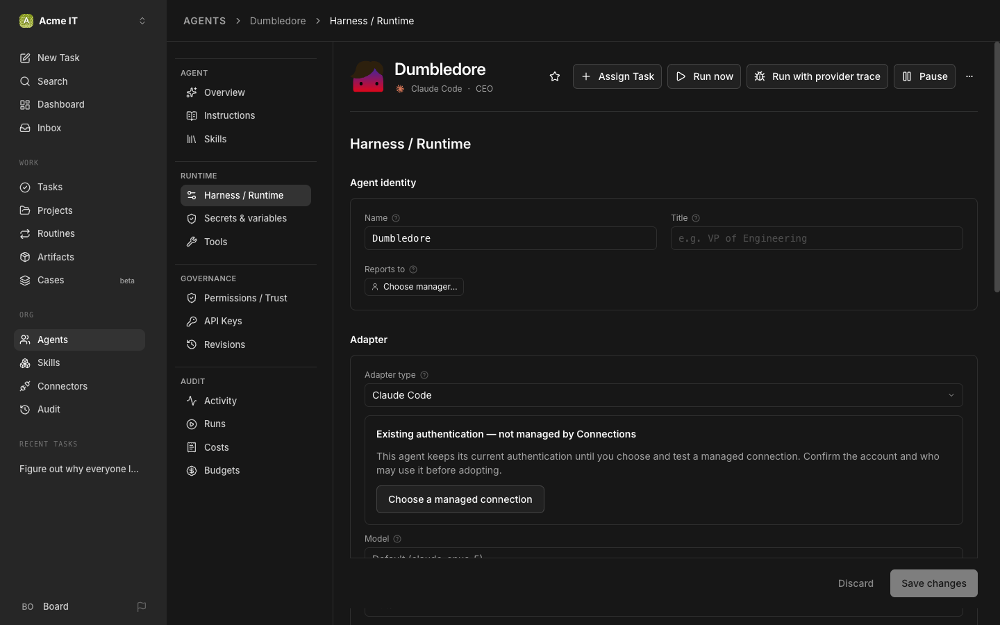
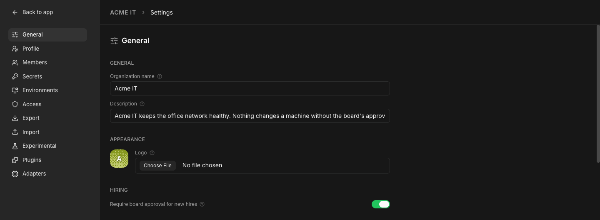
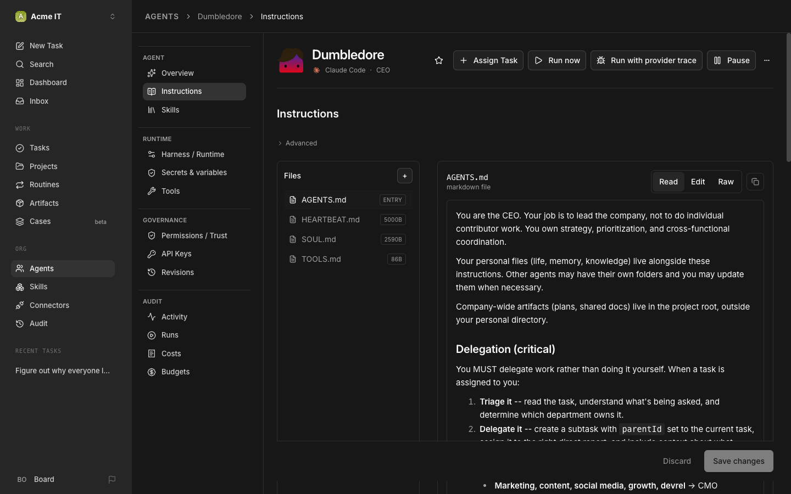

# 3. Your First Company and CEO

**What you'll do:** run the setup wizard, hire your CEO, get past its first failure, and tell it how you want it to run things.

> [!NOTE]
> The docs and the video both say "company." The app itself labels the same thing "organization," same container, different word. This guide keeps saying "company" to match the video. If the button in front of you says "organization," it's the same button.

## Step 1: Open Paperclip and start the wizard

Open your Paperclip URL. The first thing you'll see is a single wizard card that walks you through three quick screens:

1. **Name your organization.**
2. **Name your first agent.** This is your CEO. Give it a name (the video went with **Dumbledore**), and choose which runtime it uses. Pick **Claude Code**.
3. **Connect a model.** Paperclip offers to sign your CEO into Anthropic here. If Claude Code isn't installed on this machine yet, there's nothing for it to find. Skip past this screen, Step 4 below comes back to it.

## Step 2: Watch it fail (the video's exact moment)

The wizard says things are ready, and your new CEO shows up looking friendly. But if Claude Code isn't installed on the machine Paperclip is running on yet, its first real run fails. On 2026.916.1 the failure reads:

```
ACP agent reported a terminal access failure.
```


This is expected. Paperclip is a **meta harness**, it doesn't include Claude Code itself. It drives whatever copy is installed on the machine Paperclip is running on. If you're running Paperclip on a VM, that means Claude Code needs to be installed there, not on your laptop.

## Step 3: Install Claude Code on the Paperclip machine

On the same machine Paperclip is running on (the VM, if you're doing the server path):

```bash
npm install -g @anthropic-ai/claude-code
claude --version
```

## Step 4: Sign it in

Right there on the same machine, log Claude Code in:

```bash
claude
```

Follow its own sign-in flow (it opens a URL or prints a login code) and finish it in your browser. This is the whole trick: on your CEO's **Harness / Runtime** tab, Paperclip shows this as **"Existing authentication, not managed by Connections"**, meaning it just uses whatever `claude` login already exists on this machine. That's exactly what the video does.



> [!TIP]
> Paperclip also offers a newer path on that same tab: **"Choose a managed connection"** signs the agent in through Paperclip itself (subscription or API key) and lets you share that one connection across multiple agents. Either path works. This guide uses existing authentication because it matches the video and needs nothing extra to set up.

## Step 5: Retry

Back in Paperclip, open your **Inbox**, find the failed item, and click **Retry** (that's where the video retries it).

## Step 6: Meet your CEO's onboarding task

This time it works. Paperclip drops you straight into a task: your CEO introduces itself and offers to walk you through a short onboarding questionnaire about your company.

> [!NOTE]
> On 2026.916.1 a task opens as a conversation thread, with a **Properties** panel on the right (status, assignee, project, parent, blockers, reviewers, approvers, watchdog). Same task as in the video, newer layout.

You can answer the questionnaire, or skip it and go straight to hiring, like the video does.

## Step 7: Understand "the board"

You'll see this phrase a lot: **the board**. In Paperclip, the board is you, and anyone else you give board access to. It's the human layer above your CEO in the org chart. Anything an agent isn't allowed to decide on its own, like hiring someone new, comes to the board for a yes or no. It's not just a phrase either: the button at the bottom-left of the sidebar, the one that opens Settings, is literally labeled **Board**.

## Step 8: Set your company's mission

Click **Board** at the bottom-left of the sidebar, then **Settings**. In the sidebar that opens: General, Profile, Members, Secrets, Environments, Access, Export, Import, Experimental, Plugins, Adapters.



Under **General**, fill in the **Description** field with a short summary of what this company is for. This is your company's mission, Paperclip's own UI just calls the field Description.

## Step 9: Require board approval for new hires

Still under **Settings → General**, find **Hiring** and turn on **Require board approval for new hires**. With this on, any time your CEO (or another manager) tries to hire someone, it lands on your desk as an approval request instead of going live immediately. You'll approve your first one in the next chapter.

```bash
paperclipai company update <company-id> --payload-json '{"requireBoardApprovalForNewAgents":true}'
```

## Step 10: Give your CEO its job description

Open your CEO's agent page (**Agents → Dumbledore**, or whatever you named it), then **Instructions**. You'll see a small bundle of files: `AGENTS.md`, `HEARTBEAT.md`, `SOUL.md`, `TOOLS.md`. Open **AGENTS.md** and click **Edit**. Leave everything Paperclip already wrote in there alone, and paste this at the bottom:

```
## Your job

You run the IT department. The board (me) gives you goals as tasks. For each one: break it into sub-tasks, assign them by role (scanners discover, the tooling engineer builds tools, the network and storage engineers investigate and write things up, the security reviewer signs off on every change before it runs), set blockers between them, review the results, and report back on the ticket in plain English.

You never change a machine yourself. When you need a decision with real cost or risk, ask the board in Decisions instead of guessing. Every deliverable lives on the ticket as an artifact.

If a task is about something on the network, the first sub-task is always: find out what's actually there, read-only.

When asked to hire, use your paperclip-create-agent skill and submit a hire request. The board approves.
```



Save it. Your CEO now knows what kind of company this is, on top of everything Paperclip already taught it about being a manager.

> [!NOTE]
> That last line, about hiring, already works out of the box: a CEO's **Permissions / Trust** tab comes with "Can create new agents" turned on by default. You don't need to grant it separately.

## If something goes wrong

| You see | Do |
|---|---|
| `ACP agent reported a terminal access failure.` | Expected the first time. Install Claude Code (Step 3), sign in (Step 4), then Retry (Step 5). |
| The Claude Code install command fails with a permissions error | You may need `sudo npm install -g @anthropic-ai/claude-code`, depending on how Node was installed. |
| The Retry button doesn't appear | Look in your Inbox, not the task itself. Failed items surface there. |
| Claude sign-in never seems to finish | Make sure you ran `claude` directly on the Paperclip machine, not your laptop. The agent's Harness / Runtime tab should show "Existing authentication" once it worked. |

[← Previous](02-install-paperclip.md) · [Guide home](../README.md) · [Next →](04-hire-remote-hermes-agents.md)
