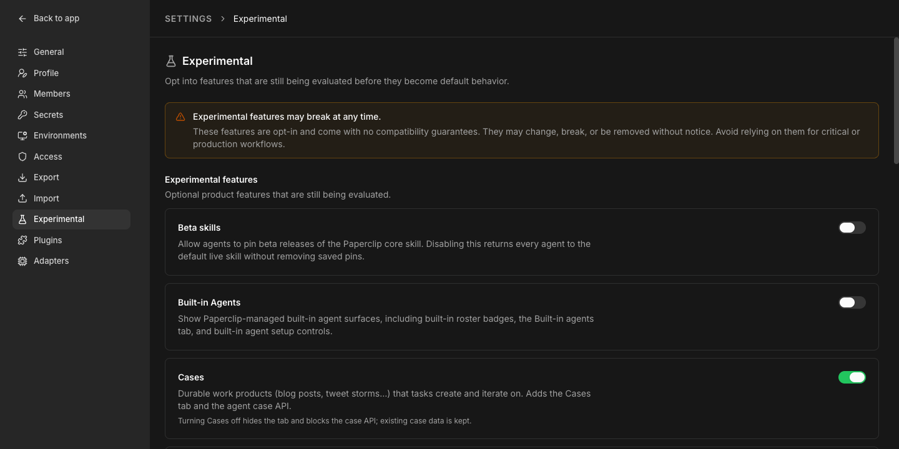
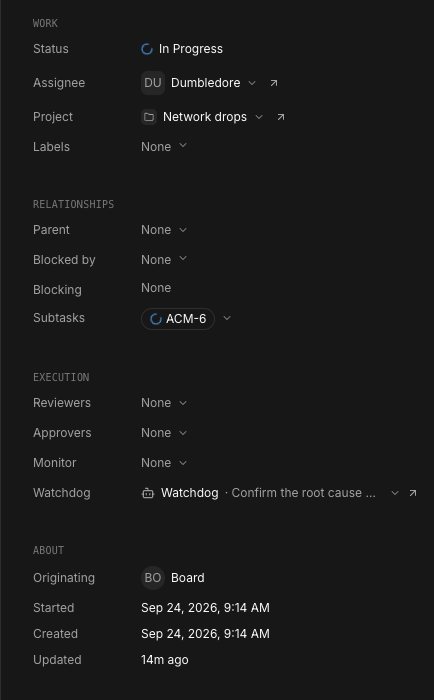
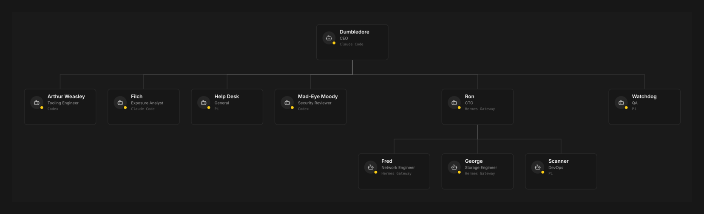

# 6. Give them work

Hand the team a real problem, then watch statuses, blockers, escalation, and the paper trail all work together.

## 1. Make a project for the work

**Projects → New project.**

```bash
paperclipai project create --company-id <company-id> --name "Network drops"
```

**What you should see:** a new project with its own board. Everything you file next lives inside it.

> [!TIP]
> The description of the video mentions shared goals. Paperclip has **Goals** too: company-level objectives your projects can point at (`paperclipai goal --help`, and `project create --goal-ids`). You don't need them to follow this guide, but they're how you tell every agent what the company is ultimately for.

## 2. Statuses, and what actually wakes an agent

A task moves through: `backlog` → `todo` → `in_progress` → `in_review` → `done`, with `blocked` and `cancelled` as detours.

- **Assigning a task to an agent wakes it.** So does a comment that @mentions it.
- **Sub-tasks** use a parent task. When every child reaches a terminal state, the parent wakes back up.
- **Blockers** are their own field, `blockedByIssueIds`. Typing "blocked by PAP-3" in a comment does nothing on its own; only the field triggers the automatic wake once every listed blocker is done.

## 3. The three task modes

The message box at the bottom of every task has a mode selector. It starts on **Auto mode**; Paperclip's docs describe the three working modes you can steer a task into:

- **Agent mode** (default): full checkout, does the work, produces an artifact.
- **Ask mode**: skips all of that. The contract is just an answer, posted as a reply in the thread.
- **Plan mode**: the contract is a plan, for your review before anything gets built.

## 4. File your first real investigation

This is the toilet ticket from the video, reshaped for whatever's actually broken at your place. Fill in the brackets and assign it to your CEO, inside the project you just made:

```
Problem: [what breaks, in one sentence. Example: everyone loses the NAS at the same moment, a few times a day.]

What I know so far:
- When it happens: [times, how often, anything it lines up with]
- Who it hits: [everyone at once, or one person at a time]
- What's involved: [the devices, switch, server, cables you suspect]
- What I've already tried: [...]

What I want: find the real cause and tell me what to fix. Start read-only: map what's actually there before touching anything. Nothing changes a machine without my approval. If you need a decision from me, ask in Decisions. Put every report, map and log you make on the task as an artifact.
```

(Full copy: [`prompts/tasks/first-investigation.md`](../prompts/tasks/first-investigation.md).)

**What you should see:** the CEO breaks it into sub-tasks and assigns them out by role.

## 5. Turn on Cases

A case is a work object for messy, document-heavy investigations, bigger than one task: fields, attached documents with revision history, an event timeline, and links back to every issue that fed it. It's off by default.

**Bottom-left "Board" menu → Settings → Experimental → Cases** toggle (its on-screen hint: "Durable work products... that tasks create and iterate on").

```bash
paperclipai instance settings:experimental:update --payload-json '{"enableCases":true}'
```



**What you should see:** a new **Cases (beta)** item appears in the sidebar under WORK. On a big enough investigation, your CEO may open a case on its own, the way it did for the toilet ticket in the video.

## 6. Task controls and properties

Every task has a **Properties** panel on the right, in four groups: **WORK** (Status, Assignee, Project, Labels), **RELATIONSHIPS** (Parent, Blocked by, Blocking, Subtasks), **EXECUTION** (Reviewers, Approvers, Monitor, Watchdog), and **ABOUT**.



The controls the video clicks (pause, subtree, cancel, hide) are in the task's **More task actions** menu (the ••• button at the top of the task) on 2026.916.1: **Pause work** or **Pause subtree**, **Cancel subtree**, and **Hide this task**. Pausing a subtree stops the task and everything under it; hidden tasks keep their full history.

## 7. The escalation chain

Agents don't come running to you the moment something's unclear. If an agent hits a wall, it kicks the task back to whoever assigned it, usually the CEO. If the CEO can't solve it either, or needs a call only you can make, it comes to you, the board. In the video those calls show up as questions in **Decisions** (step 10).

## 8. Org chart and audit log

Two more sidebar views, both under **ORG**: the **Agents** page has an **Org chart view** button (top right) that draws who reports to whom, right now.



 **Audit** is the company-wide, chronological record of everything that happened, live as it happens and browsable after the fact, what the video calls "activity" and "timeline."

## 9. Artifacts

Agents don't just leave comments, they produce things: a report, a map, a generated file. **Sidebar → Artifacts** (under WORK) collects every document, attachment, and work product your agents made, each one linked straight back to the task that produced it.

## 10. Turn on Decisions and answer one

Also off by default, same place as Cases:

**Bottom-left "Board" menu → Settings → Experimental → Decisions.**

```bash
paperclipai instance settings:experimental:update --payload-json '{"enableDecisions":true}'
```

A **Decisions** page then shows one ranked queue for everything that needs a human call, instead of checking approvals, blocked tasks, and budget warnings separately. In the video, the CEO asks a question there ("does everyone lose it at the same instant, or does each person lose it separately?"), Chuck picks an answer, and for one question he types his own under **Other**.

## If something goes wrong

| You see | Do |
|---|---|
| A task sits in `blocked` and never wakes back up | A free-text "blocked by X" comment does nothing. Set the blockers field explicitly. |
| You don't see Cases or Decisions anywhere | Both are experimental and off by default. Bottom-left "Board" menu → Settings → Experimental. |
| An agent goes quiet mid-task | Check its Properties panel. It likely escalated to its parent (usually the CEO) instead of messaging you directly. That's by design. |
| You can't find a report an agent made | Check Artifacts, not the task's comments. Reports, maps, and logs land there. |

[← Previous](05-build-the-team.md) · [Guide home](../README.md) · [Next →](07-approvals-and-watchdogs.md)
