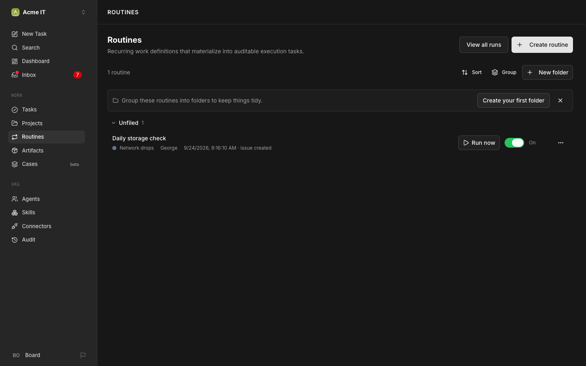

# 8. Routines and standups

Turn a one-off task into something that runs itself, then build the daily standup the whole team holds without you.

## 1. Create a routine

**Routines page → "Create routine"** button (top-right, next to "View all runs"): a title, the agent responsible, an optional project, and instructions written in plain English, exactly like a task.



## 2. Add a trigger

A routine does nothing until it has a trigger.

- **Schedule**: a cron expression plus a timezone, saved from your browser's timezone at the moment you create it.
- **Webhook**: a signed URL; an external system posting to it fires the routine the same as a schedule would.

## 3. Build the daily storage check

The routine from the video. **Routines → Create routine:**

- **Title:** `Check storage`
- **Responsible:** your storage engineer (in the video Chuck picks Fred; in this guide's org chart the storage engineer is George)
- **Project:** none is fine
- **Trigger:** Schedule, every day at 10:00 (your timezone)

**Instructions:**

```
Every day: check the storage on [server name] and look for any health issues (failed or degraded disks, pools, full volumes). Report how much storage is left on each volume. If anything is low or unhealthy, create a decision for the board with what you found and what you recommend. If everything is fine, say so in one line.
```

(Full copy: [`prompts/routines/daily-storage-check.md`](../prompts/routines/daily-storage-check.md).)

## 4. Run it now, before you trust the schedule

Every routine's row on the Routines page has its own **"Run now"** button, right next to its On/Off toggle. Click it, or use the CLI:

```bash
paperclipai routine run <routine-id>
```

**What you should see:** a new task, created immediately, same as if the schedule had fired. In the video, this surfaced a real decision on the first run: low SSD capacity, reported before the 10 AM trigger ever would have fired on its own.

## 5. Concurrency and catch-up policy

Two settings that matter once a routine is actually running unattended:

- **Concurrency policy**: what happens if the previous run is still going when the next tick arrives. `coalesce_if_active` folds it into one queued follow-up, `skip_if_active` drops the new tick, `always_enqueue` runs both. Default is `coalesce_if_active`.
- **Catch-up policy**: what happens to ticks missed while the routine was paused or the server was down. `skip_missed` (the default) just picks up from now; `enqueue_missed_with_cap` catches up in a capped batch instead of silently losing them.

## 6. Variables and secrets, on the routine itself

A routine's detail page has two more sections beyond instructions:

- **Variables**: `{{name}}` placeholders, auto-detected in your title and instructions, each configurable as text, a number, a boolean, a dropdown, or a date, with a default you can override on a single "Run now."
- **Secrets**: environment values the routine's created task can reference, the same secrets mechanism Chapter 9 uses for Flare.

## 7. Build the daily standup

This is how the agents in the video hold a standup every day at 5 PM: one routine, assigned to the CEO, that turns into a task, gives every agent a sub-task to write their own brief, collects them, lets the agents ask each other questions, and posts one digest.

**Routines → Create routine:**

- **Title:** `Daily Standup`
- **Responsible:** your CEO
- **Trigger:** Schedule, every day at 17:00
- **Advanced:** if a standup is still running, don't start another (`coalesce_if_active`); skip missed runs

The instructions run the whole thing in five phases: fan out one sub-task per agent for their brief, collect the briefs onto the parent task, a second pass where each agent can ask a teammate a real question, the CEO gates and routes those questions, then one digest comment closes it out. An agent that never answers in ten minutes is marked absent and the standup continues without it. The full instructions text (edit the roster to match your own team): [`prompts/routines/daily-standup.md`](../prompts/routines/daily-standup.md).

## 8. Watch it run

**What you should see:** a parent task with one sub-task per agent, each carrying that agent's own brief as a comment, then a Q&A round, then one `Daily Digest` comment on the parent with three sections: what each agent did, anything cross-team, and the Q&A. As the prompt file itself notes: one agent asking another a real question, something no status report would have surfaced, is the part worth watching for.

## If something goes wrong

| You see | Do |
|---|---|
| Your routine fires at the wrong time | Schedule triggers save the timezone from your browser at creation time. Re-save the trigger from the timezone you actually want. |
| Two runs stack up while you're testing "Run now" repeatedly | Set concurrency policy to `skip_if_active` or leave it at `coalesce_if_active`, not `always_enqueue`. |
| The standup dies with every brief finished but the parent task never closes | The CEO left the parent task `in_progress` with nothing queued instead of `blocked` with blockers listed. See the note in the standup prompt file. |
| One agent in the standup never answers | After ten minutes it's recorded absent and the rest continue. That's expected, not a bug. |
| A missed nightly run never happened after downtime | Default catch-up policy is `skip_missed`. Use `enqueue_missed_with_cap` if you want it to catch up instead. |

[← Previous](07-approvals-and-watchdogs.md) · [Guide home](../README.md) · [Next →](09-plug-in-flare.md)
