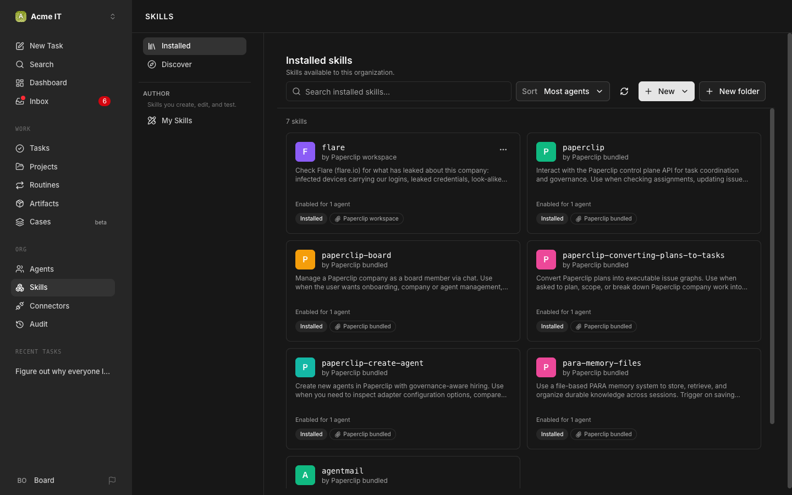
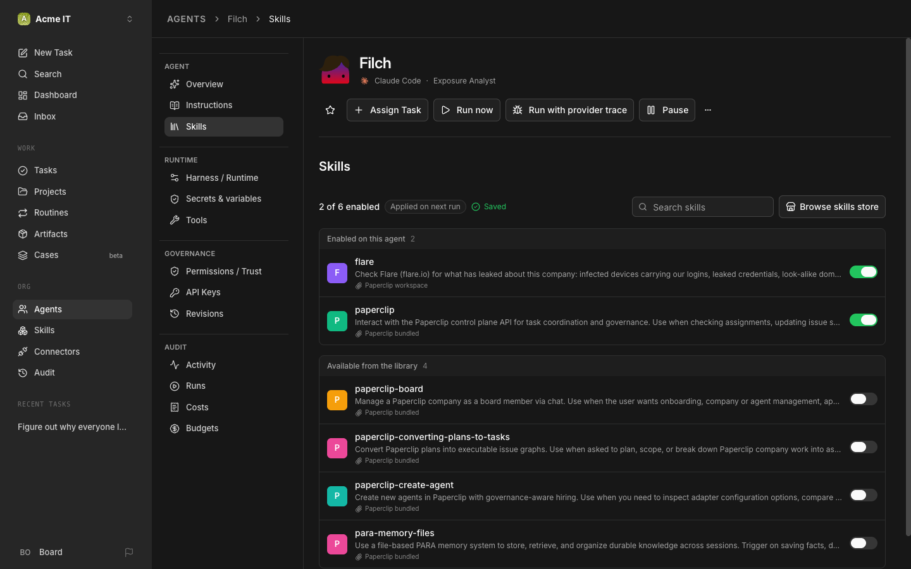

# 9. Plug in Flare

Hire an agent that watches what's already leaked about your company, and give it just enough access to act on it.

Flare sponsored the video. It's an identity threat intelligence platform: it watches stealer logs, Telegram, dark web forums, and breach dumps, and matches what it finds against your company's own domains and people. Try it for free at [ntck.co/flare](https://ntck.co/flare).

## 1. Sign up and get your credentials

Sign up, then grab two values from the Flare app:

- **API key**: Profile → API Keys.
- **Tenant ID**: Profile → Tenants (see [Flare's auth docs](https://api.docs.flare.io/concepts/authentication) if you're not sure which tenant is yours).

You may only need the key to start; the tenant ID can come later, see step 6.

## 2. Create the FLARE_API_KEY secret

In Paperclip: the account menu at the bottom left (**Board**) → **Settings** → **Secrets** → **New secret**. Name it `FLARE_API_KEY` and paste the key.

Or from the terminal on the Paperclip machine:

```bash
read -rs FLARE_API_KEY && export FLARE_API_KEY
paperclipai secrets create --company-id <company-id> --name FLARE_API_KEY --value-env FLARE_API_KEY
unset FLARE_API_KEY
```

`read -rs` waits for you to paste the key without showing it, so it never lands on screen or in your shell history. `--value-env` tells Paperclip to read the value from that variable instead of the command line.

## 3. Bring the flare skill into your company

This repo ships a company skill at [`skills/flare`](../skills/flare), a `SKILL.md` plus a script (`scripts/flare.ts`) that actually calls the Flare API. Two rules govern how a local skill like this one gets in:

1. **Only a local-path import can carry a script.** A GitHub-hosted skill source is blocked outright if it contains any executable script, full stop.
2. **Point the import at the skill's *parent* folder, not the skill's own folder.** Pointing directly at `flare/` only picks up `SKILL.md`, the script gets silently dropped with no warning. Point at the folder that *contains* `flare/` instead.

Paperclip also refuses a random folder on disk as a source ("outside approved company workspace roots"). The folder it does accept is your company's own managed-skills folder. So, on the Paperclip machine, as the user Paperclip runs as:

```bash
git clone https://github.com/theNetworkChuck/paperclip-guide.git
mkdir -p ~/.paperclip/instances/default/skills/<company-id>
cp -r paperclip-guide/skills/flare ~/.paperclip/instances/default/skills/<company-id>/
```

Then import, pointing at the **parent** folder (the one that contains `flare/`):

```bash
paperclipai skills import ~/.paperclip/instances/default/skills/<company-id> --company-id <company-id>
```

Don't know your company ID? `paperclipai company list` prints it.

> [!NOTE]
> On a server set up in Private network mode, the CLI needs to be logged in as you first: `paperclipai auth login --instance-admin --no-browser`, then open the link it prints (swap `localhost` for the server's IP) and approve. On a Quickstart install the CLI already has access.

**What you should see:** `flare` in **Skills**, and its file list shows both `SKILL.md` and `scripts/flare.ts` (trust level "scripts executables"). If you only see `SKILL.md`, you pointed at the `flare` folder itself. Run the import again on the parent folder; the same skill updates in place.



## 4. Hire the exposure analyst

This is Filch from the video. Assign a task to your CEO:

```
Hire an exposure analyst named Filch. Run him on Claude Code. His job: watch our company in Flare, the identity threat intelligence platform we use, and turn what it finds into tickets for the right engineer.

How he works: he uses the company skill called "flare" (it is in the Skills library; attach it to him). The skill runs a small script that reads our Flare feed. His Flare access arrives as two environment variables on his configuration page: FLARE_API_KEY and FLARE_TENANT_ID, each bound to a company secret of the same name. The board sets those; he never needs to see or ask for the key itself.

His rules: he reports counts, our domains, sources and dates, and the fix. He never writes an email address, a password, a cookie or a stealer-log file name into a ticket, comment or file. For infected devices carrying our logins he files a ticket to the CTO to force password resets and revoke sessions for the affected accounts. For a look-alike domain he files a ticket to the Security Reviewer to judge it. A ransomware mention comes to you the same hour. Submit it as a hire request and tell me when it's waiting for my approval.
```

(Full copy: [`prompts/hire/exposure-analyst.md`](../prompts/hire/exposure-analyst.md).) Approve the hire the same way as Chapter 5, step 4.

## 5. Give Filch the skill and the secret

A new agent starts with neither. In the video, Filch was hired before he had the key, and Chuck gave it to him afterwards.

**The skill:** Agents → **Filch** → **Skills** → turn on **flare**. (If the CEO already attached it while hiring, it's on.)



**The secret:** Agents → **Filch** → **Harness / Runtime** → **Environment variables** → **Add variable**. Name it `FLARE_API_KEY`, choose **Secret**, pick the `FLARE_API_KEY` secret, then **Save changes**. Paperclip injects the value when Filch's run starts; it never shows up in his config as plain text.

Prefer the terminal for the skill? (Verified on 2026.916.1.)

```bash
paperclipai skills agent sync <filch-agent-id> --skill <flare-skill-id> --mode add --company-id <company-id>
```

> [!WARNING]
> Do the secret in the UI. `paperclipai agent update` with an `adapterConfig` replaces the agent's whole adapter config, so sending only the environment variable would wipe its model and other settings.

**What you should see:** Filch → **Secrets & variables** lists `FLARE_API_KEY` as an "Env var" binding.

## 6. Add the tenant ID when Filch asks for it

If you only created `FLARE_API_KEY` in step 2, Filch will notice the missing tenant ID on his first real run and raise it as a question in **Decisions** (Chapter 6). Create a second secret the same way and bind it the same way:

```bash
read -rs FLARE_TENANT_ID && export FLARE_TENANT_ID
paperclipai secrets create --company-id <company-id> --name FLARE_TENANT_ID --value-env FLARE_TENANT_ID
unset FLARE_TENANT_ID
```

Then add it to Filch's **Environment variables** exactly like step 5 (name `FLARE_TENANT_ID`, choose **Secret**). That's what happens in the video: Filch asks for the tenant ID in Decisions, Chuck creates the second secret, gives it to Filch, and tells him to run the sweep.

## 7. Run the first sweep

Assign this to Filch once he has the skill and both secrets:

```
What of ours is already out there? Run the flare skill: check, identifiers, summary for the last 90 days, and lookalikes. Report the infected devices carrying our logins, the leaked credentials on our domains, and every look-alike domain: how many, which of our domains, from where, how old. Then file one ticket to the CTO to force password resets and revoke sessions for the affected accounts, and one ticket to the Security Reviewer to review each look-alike domain. Counts only. No emails, no passwords in any ticket.
```

(Full copy: [`prompts/tasks/flare-first-sweep.md`](../prompts/tasks/flare-first-sweep.md).)

**What you should see:** a Flare exposure report as a comment or artifact, followed by real tickets to the agents named in the report, one per finding type.

## 8. Pause any agent that overreaches

In the video, Filch went further than asked, filing password-reset tickets to Ron that nobody explicitly requested. Chuck stopped it with the task's own **Pause** control (Chapter 6, step 6), no special override needed. You can do the same at any time: open the task, click **Pause**. You're the board, not a spectator.

## If something goes wrong

| You see | Do |
|---|---|
| Filch reports the key was refused | Flare API tokens expire hourly; the skill mints a fresh one on every run. A refusal means the key value itself is wrong, not stale. Recheck it in Settings → Secrets. |
| A ticket shows a raw email, password, or file name | That's not the shipped flare skill running. The real one hides those fields at the source; if you see them, something else generated the ticket. |
| Filch asks for `FLARE_TENANT_ID` in Decisions | Expected the first time, if you only created `FLARE_API_KEY`. Create the second secret (step 6) and bind it. |
| The skill import only shows `SKILL.md`, no script | You imported from the skill's own folder. Point the import source at its parent folder instead (step 3). |
| Import fails with "outside approved company workspace roots" | Local skill imports only work from inside a Paperclip-managed folder. Copy the skill folder into your company's managed-skills directory first. |
| An agent starts doing work you didn't ask for | Open the task and click Pause. |

[← Previous](08-routines-and-standups.md) · [Guide home](../README.md) · [Next →](10-export-your-company.md)
