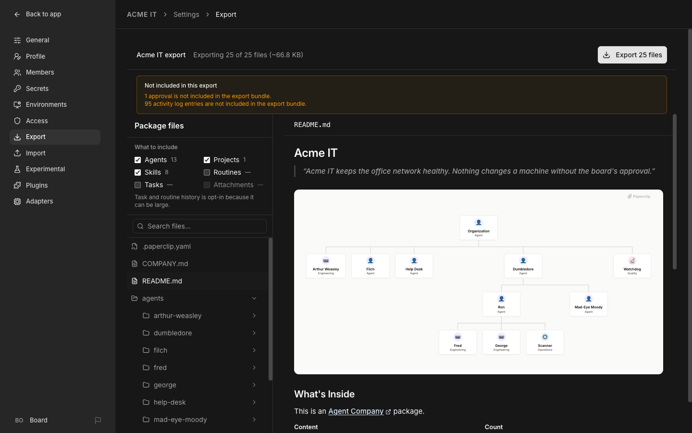

# 10. Export your company

Everything you built, agents, routines, tasks, and skills, packaged into one folder you can back up, move, or hand to someone else.

## 1. Why you'd do this

A company export is a full-fidelity backup: move to a new machine, stand up a copy for testing, or hand your exact setup to someone else as a starting point.

## 2. Export from the UI

The account menu at the bottom left (**Board**) → **Settings** → **Export**. (In the video, Chuck reaches the same place from the org page's Import / Export organization buttons.)

Pick what to include (Agents, Projects, Skills, Routines, Tasks, Attachments), browse the package files before you download, and click **Export N files** to get one `.zip`. The package even ships a README with your org chart drawn in it.



## 3. What's included, and what's deliberately left behind

**Included:** company name and description, hiring policy, every agent (identity, role, reporting line, instructions, adapter config, permissions, per-agent budget), projects and their workspaces, skills, tasks with comments/status/blockers/documents/work products, routines and their triggers, attachments, and the *names* of the environment variables each agent expects.

**Never included:** secret values, machine-specific paths, internal database IDs.

**Deliberately left behind:** approvals, cost history, activity log entries. The export screen tells you how many of each it's leaving out before you download.

## 4. Export from the CLI

```bash
paperclipai company export <company-id> --out ./my-company --include company,agents,projects,issues,skills
```

**What you should see:** a folder of plain-text files, `README.md`, `COMPANY.md`, one `AGENTS.md` per agent, one `PROJECT.md` per project, `skills/`, `tasks/` with their comments and documents, plus a `.paperclip.yaml` describing adapter types, declared env var names, and budgets. Because it's all plain text (aside from attachment blobs), it diffs cleanly in git.

## 5. Import into a new company

```bash
paperclipai company import ./my-company --target new --new-company-name "My Company" --yes
```

Want to look before you leap? Run it with `--dry-run` instead of `--yes` for a preview only: agent, project and task counts, and what will be created, renamed or skipped. Without either flag it shows the preview and asks you to confirm (in a script it refuses: "Applying a company import from a non-interactive terminal requires --yes").

## 6. The secret-bound-agent gotcha

If any agent's environment references a secret by ID (the way Filch's `FLARE_API_KEY` does in Chapter 9), importing into a brand-new company fails:

```
422: Secret must belong to same company
```

The new company doesn't have that secret ID, so it correctly refuses to create an agent that references it. There's no automatic remap. Fix it one of two ways:

- **Before exporting**, remove the secret rows from that agent's environment (the agent → **Harness / Runtime** → **Environment variables**, delete the rows bound to a secret, **Save changes**). Export, import, then in the new company create the secrets again and bind them back the same way. Secret values never travel in an export anyway, so you'd be re-entering them regardless.

- Or import into an **existing** company that already has a secret with the matching ID (mainly useful for restoring into the same instance you exported from).

## 7. Skill name collisions on import

Every company starts with its own bundled default skills. If your export also contains those same skill names, the default collision behavior renames the incoming ones with a `-2` suffix rather than skipping them, so you can end up with duplicates. Add `--collision skip` to the import command if you don't want that (the options are `rename`, the default, `skip` and `replace`).

## If something goes wrong

| You see | Do |
|---|---|
| Import fails with `422: Secret must belong to same company` | An agent in the export has a secret bound by ID. Clear that agent's env binding before exporting, or import into a company that already has a matching secret. |
| Import stops with "requires --yes" | You ran it non-interactively. Preview with `--dry-run`, then re-run with `--yes`. |
| Every bundled skill in the new company got a `-2` suffix | The default collision strategy renames instead of skipping. Re-import with `--collision skip`. |
| Approvals, cost history, or activity are missing after import | Expected. Those never travel with an export, by design. |

[← Previous](09-plug-in-flare.md) · [Guide home](../README.md) · [Next →](11-troubleshooting.md)
